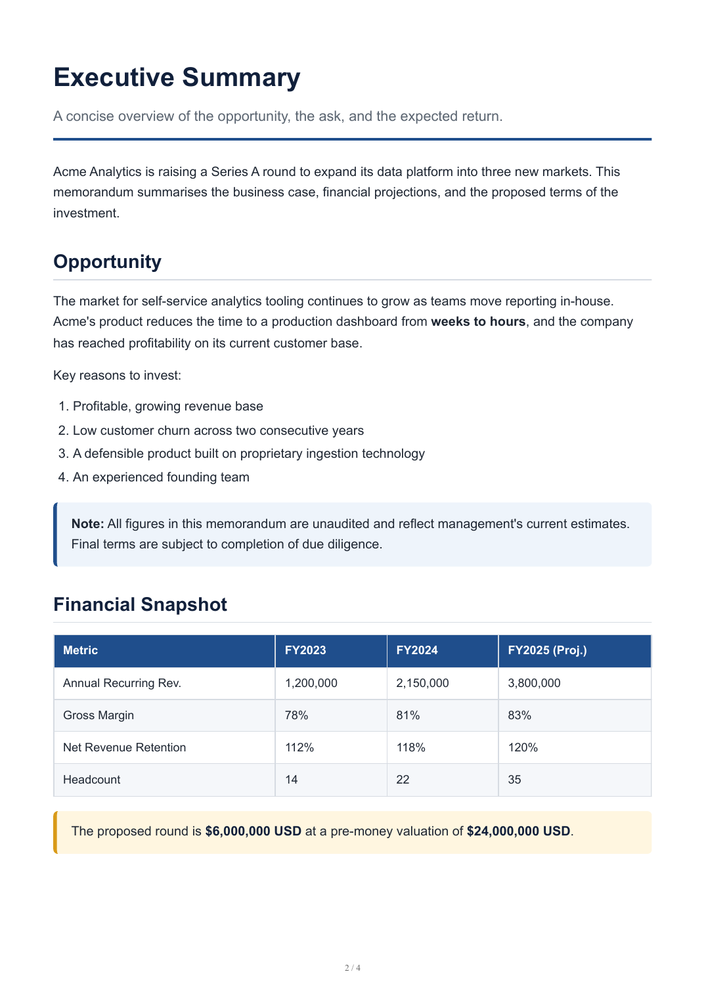
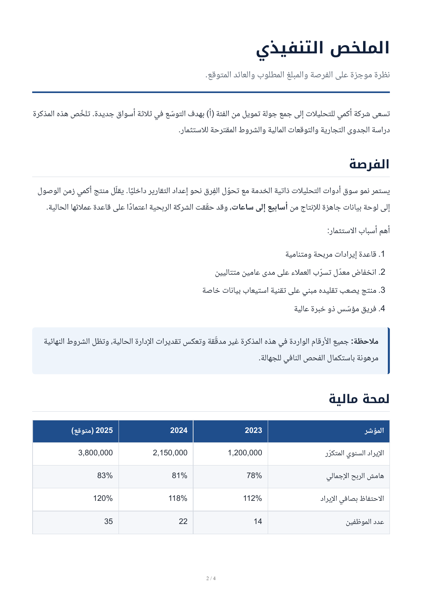

# Professional Markdown PDF Exporter

> Export Markdown files to polished Arabic RTL or English LTR A4 PDFs directly from VS Code.

Professional Markdown PDF Exporter turns ordinary `.md` files into clean,
print-ready A4 documents — business reports, proposals, investment memos,
technical specifications and legal drafts — without Python, WeasyPrint, or a
bundled browser. It renders Markdown with [`markdown-it`](https://github.com/markdown-it/markdown-it)
and prints through a Chrome / Chromium / Edge browser already installed on
your machine.

---

## Features

- **Arabic RTL preset** — right-to-left layout with Arabic-friendly typography
- **English LTR preset** — left-to-right layout with English-friendly typography
- **A4 document rendering** with proper print margins
- **Professional print CSS** tuned for Chromium's print engine
- **Page numbers** in the footer (`page / total`)
- **Table styling** with alternating row stripes
- **Cover pages**, **note boxes**, **highlight boxes** and **signature sections**
- **Syntax-highlighted code blocks** — highlighted at export time, no scripts run
- **Bundled Arabic fonts** (Noto Naskh / Noto Kufi) — identical output on every machine
- **Local image support** — relative paths are resolved automatically
- **Right-click export** from the Explorer
- **Command Palette support**
- **Lightweight architecture** — uses your installed Chrome/Chromium/Edge, nothing is bundled

---

## Screenshots

Actual PDF output rendered from the bundled sample documents:

| English preset | Arabic preset |
| -------------- | ------------- |
|  |  |

_Regenerate these locally with `node scripts/verify-export.js` after `npm run compile`._

---

## Requirements

- **VS Code** `1.85.0` or newer
- **Google Chrome**, **Chromium**, or **Microsoft Edge** installed on your system

A reasonably modern browser version is recommended for the best print-CSS
behaviour (page-number footers in particular). See
[Browser configuration](#browser-configuration).

---

## Installation (for development)

```bash
npm install
npm run compile
```

## How to run locally

1. Open the project folder in VS Code.
2. Press `F5` to launch the **Extension Development Host**.
3. In the new window, open a `.md` file (try the bundled samples in
   [`test/sample-documents/`](test/sample-documents/)).
4. Run **`Markdown PDF: Export PDF...`** from the Command Palette.

---

## Usage

### Explorer right-click workflow

Right-click any `.md` or `.markdown` file in the Explorer and choose
**Export PDF...**. A Quick Pick appears so you can select the Arabic or
English preset. The PDF is written next to the Markdown file.

### Command Palette workflow

With a Markdown file open in the editor, open the Command Palette
(`Ctrl/Cmd+Shift+P`) and run one of:

| Command                              | Behaviour                                    |
| ------------------------------------- | -------------------------------------------- |
| `Markdown PDF: Export PDF...`        | Prompts for Arabic or English, then exports  |
| `Markdown PDF: Export as Arabic PDF` | Exports directly with the Arabic preset      |
| `Markdown PDF: Export as English PDF`| Exports directly with the English preset     |

If the document has unsaved changes it is saved automatically before export.
Untitled documents must be saved first. If a PDF of the same name already
exists you are asked to confirm before it is overwritten.

---

## Browser configuration

The extension never downloads or bundles a browser. It locates one already
installed on your system:

- **Auto-detection** searches the standard install locations for Chrome,
  Chromium and Edge on Linux, macOS and Windows. Chrome is preferred, then
  Chromium, then Edge.
- **Manual override** — if your browser lives in a non-standard location, set
  the path explicitly:

  ```json
  "professionalMarkdownPdf.browserExecutablePath": "/opt/custom/chrome"
  ```

If no compatible browser is found, the extension shows:

> No supported browser was found. Install Chrome, Chromium, or Edge, or
> configure a browser executable path in Settings.

### Settings

| Setting                                          | Default       | Description                                            |
| ------------------------------------------------- | ------------- | ------------------------------------------------------ |
| `professionalMarkdownPdf.browserExecutablePath`  | `""`          | Custom browser path. Empty enables auto-detection.     |
| `professionalMarkdownPdf.openAfterExport`        | `true`        | Open the PDF automatically after a successful export.  |
| `professionalMarkdownPdf.outputMode`             | `sameFolder`  | Where the PDF is written. v1 saves beside the source.  |

---

## Custom Markdown HTML classes

Raw HTML is enabled in Markdown, so you can use the preset's document classes
directly in your `.md` files. Both presets style the following:

### `.cover-page`

A full-page, centred title page (forces a page break after it).

```html
<div class="cover-page">
  <h1>Investment Memo</h1>
  <p class="document-subtitle">Confidential</p>
</div>
```

### `.document-header`

A header band with an accent underline.

```html
<div class="document-header">
  <h1>Executive Summary</h1>
  <p class="document-subtitle">An overview of the opportunity.</p>
</div>
```

### `.note-box` and `.highlight-box`

Callout panels — blue for notes, amber for highlights.

```html
<div class="note-box">This is an important note.</div>
<div class="highlight-box">This is a highlighted section.</div>
```

### `.signature-box`

A row of signature lines.

```html
<div class="signature-box">
  <div class="signature-item">Founder</div>
  <div class="signature-item">Investor</div>
</div>
```

### `.status-badge`

A small pill label. Optional state modifiers: `is-draft`, `is-review`, `is-final`.

```html
<span class="status-badge is-draft">Draft</span>
```

### `.page-break` and `.keep-together`

Layout helpers.

```html
<div class="page-break"></div>

<div class="keep-together">
  <!-- content kept on a single page where possible -->
</div>
```

### `.price`, `.currency`, `.number`

Inline spans for figures. They use tabular numerals and an isolated LTR run so
amounts never reorder inside RTL Arabic text.

```html
The round is <span class="price">$6,000,000 USD</span>.
Headcount grew to <span class="number">35</span>.
```

---

## Sample Markdown

A minimal English document:

```markdown
<div class="cover-page">
  <h1>Quarterly Report</h1>
  <p class="document-subtitle">Q1 2026</p>
</div>

## Summary

Revenue reached <span class="price">$1,250,000 USD</span> this quarter.

<div class="note-box">Figures are preliminary.</div>
```

A minimal Arabic document:

```markdown
<div class="cover-page">
  <h1>التقرير الربع سنوي</h1>
  <p class="document-subtitle">الربع الأول 2026</p>
</div>

## الملخّص

بلغت الإيرادات <span class="price">1,250,000 USD</span> هذا الربع.

<div class="note-box">الأرقام أولية.</div>
```

Full, richer examples are in
[`test/sample-documents/`](test/sample-documents/).

---

## How it works

1. The Markdown file is read and rendered to HTML with `markdown-it`
   (`html: true`, `linkify: true`, `typographer: false`).
2. Relative `` paths are resolved against the Markdown file's directory
   and rewritten to absolute `file://` URIs.
3. A complete HTML document is assembled with the correct `lang`/`dir` and the
   inlined CSS preset.
4. The HTML is written to a temporary file, opened in your system browser via
   `puppeteer-core`, and printed with `page.pdf({ format: 'A4',
   printBackground: true, preferCSSPageSize: true })`.
5. The temporary file is deleted and the PDF is saved beside the source.

> **Security note.** Raw HTML inside Markdown is rendered locally as part of
> the export. The generated HTML is printed by a headless browser; the
> extension does not execute Markdown-derived JavaScript and makes no external
> network or analytics requests. Only export Markdown files you trust.

---

## Limitations

- Depends on an installed Chrome / Chromium / Edge browser.
- Best print-CSS behaviour — particularly the `@bottom-center` page-number
  footer — requires a modern browser version. Very old browsers may omit the
  footer; the extension warns but does not block the export.
- The extension is optimised for Markdown-to-document export, not arbitrary
  webpage capture.

---

## Roadmap / future enhancements

- Custom CSS presets and user-defined CSS imports
- Automatic language detection from document text
- Batch export of an entire folder
- Custom output directory and "ask every time" output mode
- PDF metadata (title, author, subject)
- Export multiple presets in a single action
- Marketplace icons and theme variants

See [ROADMAP.md](ROADMAP.md) for the full improvement plan, effort estimates,
and release sequencing.

---

## License

[MIT](LICENSE) © Ibrahim Chehab

The Arabic fonts bundled with the extension — **Noto Naskh Arabic** and
**Noto Kufi Arabic** — are licensed under the SIL Open Font License 1.1
(see [`src/styles/fonts/OFL.txt`](src/styles/fonts/OFL.txt)).
